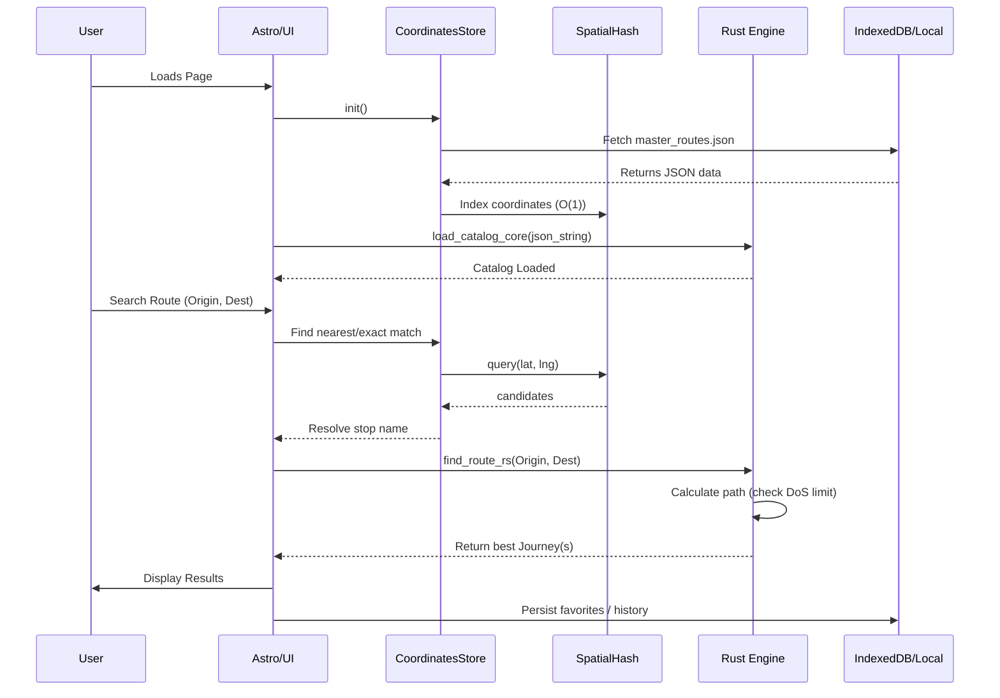

# NEXUS PRIME: System Architecture

This document details the 4-layer architecture of the MueveCancun ecosystem.

## 1. Infrastructure Layer (Render)
- **Configuration**: `render.yaml`
- **Build Script**: `scripts/build_render.sh`
- **Environment**: Static Site (Node 20)
- **Deployment Flow**:
  1. Trigger: Push to `main`.
  2. Execution: `build_render.sh` checks/installs Rust + wasm32 target.
  3. Build: Runs `pnpm run build`.
  4. Publish: Serves `./dist`.

## 2. Engine Layer (Rust/WASM)
- **Source**: `rust-wasm/route-calculator/src/lib.rs`
- **Compiler**: `wasm-pack` (via `scripts/build-wasm.mjs`)
- **Output**:
  - `public/wasm/route-calculator/route_calculator_bg.wasm`
  - `public/wasm/route-calculator/route_calculator.js`
  - (Synced to `src/wasm/...` for development)
- **Core Functions**:
  - `load_catalog_core(json_string)`: Parses the master route catalog.
  - `find_route_rs(origin, dest)`: Returns optimal path.

## 3. Intelligence Layer (Listener)
- **Status**: Partially Implemented.
- **Current Mechanism**: `scripts/sync-routes.mjs` acts as the static listener.
  - **Input**: `src/data/routes.json` (Manual Source of Truth).
  - **Process**: Normalizes data, generates search index, timestamps updates.
  - **Output**: `public/data/master_routes.json`.
- **Future Expansion**: `scripts/listener/` will house Python agents for social scraping.

## 4. Frontend Layer (Astro)
- **Framework**: Astro 5.
- **Key Component**: `src/components/RouteCalculator.astro`.
- **Data Consumption**:
  - Fetches `master_routes.json`.
  - Passes JSON string to WASM engine.
  - Renders results using Vanilla JS template literals.

## Data Flow Diagram



## Legacy Flow (High-Level)

```
[src/data/routes.json]
       | (sync-routes.mjs)
       v
[public/data/master_routes.json] ----> (HTTP Fetch) ----> [Frontend: CoordinatesStore]
                                                              |
                                                              v
                                                       [WASM: load_catalog_core]
                                                              |
                                                       (Internal Graph)
                                                              |
                                                       [find_route_rs]
```
